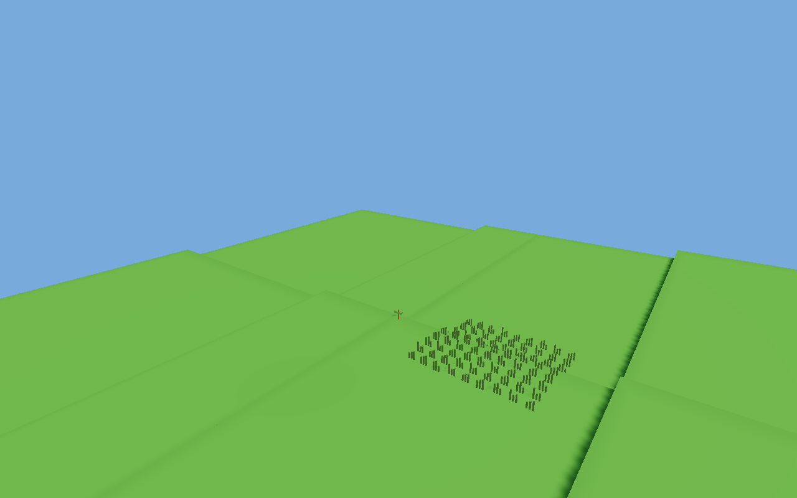
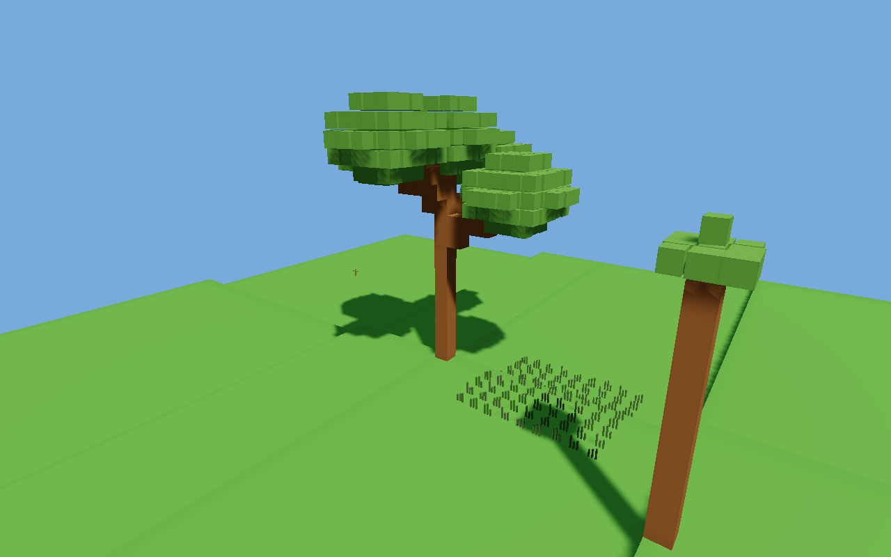
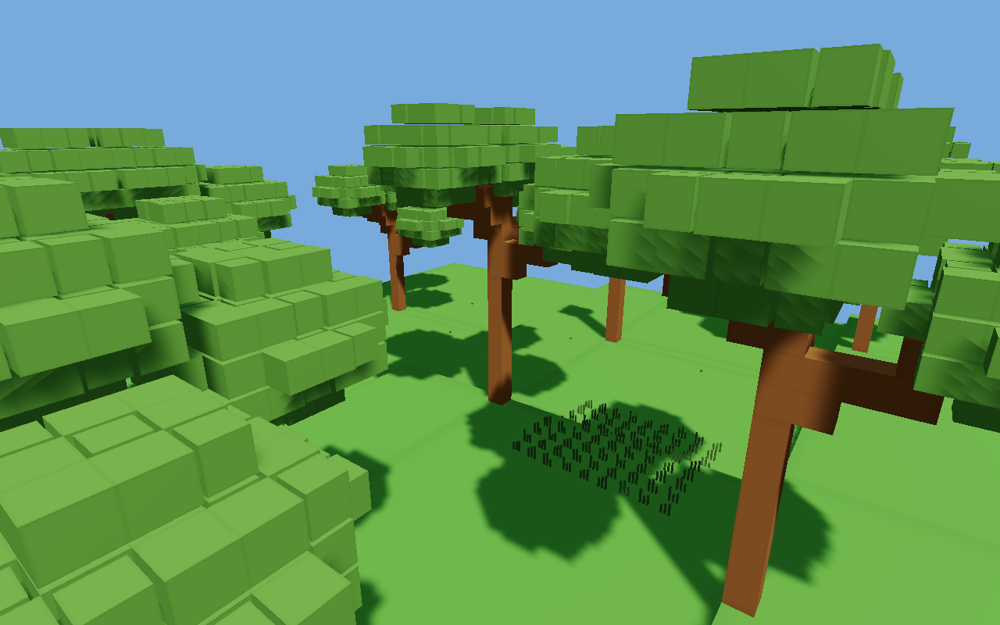

# ENG-117 corrections — 2026-10-01

## Findings and changes

The original stone slabs were the showcase arena border, viewed through a
four-cell-deep render crop around the first tree. The private Simulation contained
terrain that the window did not draw. Dispersed seed markers retained their
parent's elevation, while grass was offset from the parent instead of resolving
its own soil. The original skeleton was a six-cell trunk with eight horizontal
branch cells and no foliage; age marked it mature before geometry committed.
CubeInstance size is an edge length: the shader and unit cube were already
correct. Authoritative wood cells remain 0.25 m. Greedy draw boxes can combine
several cells and do not change resolution.

- Replace the crop with a fully resident 64 x 96 x 64-cell clearing (16 x 24 x
  16 m, shallow stepped soil, no wall), authored by the sandbox. Draw complete
  live terrain and physics bodies through the existing shared renderer.
- Resolve deposits and presentation against the first exposed, known voxel
  surface within 8 m above/below the reference height. Do not scan through a
  rock roof to find buried soil; suspend on Unknown. Germination requires
  suitable soil, moisture, clearance and horizontal spacing.
- Ground the small seed/seedling shapes and thin grass tufts by their base;
  hide unsupported markers. Grass and foliage remain presentation instances,
  never voxel entities or structural/collision occupancy.
- New persistent skeletons have a 12–14-cell trunk and four rising branches,
  with deterministic height variation, parent-before-child order and face
  adjacency. Rounded foliage clusters follow live grown tips. Use existing
  muted grass/foliage variants; do not change the manifest.
- Require committed surviving geometry as well as age for maturity. Detect
  removed roots, validate parent wood for new growth, and never propose cells
  already marked as removed by an obstructed ancestor. The ecology plan is v2;
  state encoding stays v1 and saved skeletons are not rebuilt.
- B cuts an actual side branch rather than the trunk. X stops that tree's
  growth and reproduction. Detached wood remains visible at its physics pose;
  wall-clock physics continues while ecology is paused.
- Both inspection harnesses submit single-cell intents and acknowledge the
  accepted prefix, rather than rejecting already-committed growth when the
  old multi-request batch spans several simulation ticks. This remains a
  local fixture, not an atomic production ecology/world-store transaction.

## Validation

Commands run in the dedicated `codex/eng-117-visual-corrections` checkout:

- `cargo fmt --all` — passed.
- `cargo test -p spall_ecology` — 14 passed, including the obstructed-branch/prefix regression.
- `cargo test -p spall_client ecology_demo::tests` — 3 passed: clock controls;
  seed/seedling bases and terrain holes; mature foliage, exact rendered wood
  volume, side-branch damage, root removal and retained physics bodies.
- `cargo test -p sandbox --features client ecology_scene::tests` — 1 passed:
  clearing residency and initial root/patch soil contact.
- `cargo run -p sandbox --features client --bin sandbox-client --
  --ecology-capture .local/runs/ecology-corrections` — passed on the actual GPU.
  Six 1280 x 800 images inspected using the interactive instance builder and
  GameRenderer; includes growth, spread and damage. Native mouse/keyboard
  interaction was not manually exercised by this pass.
- `cargo run -p sandbox --example ecology-clearing` — passed. At 21 ecological
  seconds: 4 plants, 3 established seedlings, 1 seed, 119 accepted wood cells,
  branch/root cuts exercised, 42 regrown biomass, no backlog, 5,212 encoded
  state bytes. Local debug elapsed 1,768 ms; step mean 64,471 us, p95
  168,065 us, max 204,499 us. Digest
  `3ec0b16a5388709c0b500684e74fbe0959d1f3ea5a61b49ba0914435cb00b286`.
- `cargo run -p sandbox --example ecology-clearing -- --large` — passed. The
  original 256 x 384 x 256-cell terrain and 128 initial plants remain; 31
  ecological seconds, work budget 1, 135 accepted wood cells, root removal,
  no branch cut or germination at that deliberately constrained budget,
  final/max backlog 128, 162,636 encoded bytes. Local debug elapsed 4,763 ms;
  step mean 90,998 us, p95 127,120 us, max 146,433 us. Digest
  `fc6ed7ae0c1f199c7d3bd2af48e128a90225be8ce6f24f34025ee60a206c8577`.
- `cargo xtask check` — passed on the final source: workspace formatting, lint and
  tests, including the previously reported dam-gate scenario. The first full
  run also passed before the final cursor/obstruction regression edits.
- `git diff --check` — passed.

The revised skeleton/work per growth event differs from ENG-116's original
14-cell tree, so its old timings/digests are historical, not comparable acceptance
numbers. The small headless species uses 12-cell spacing/16-cell dispersal and
200 ms per wood cell; the larger density stress keeps its original 4/4 spacing
and radius. No performance target or production scale gate is claimed. Encoded
state size excludes terrain, process memory and allocator overhead.

## Visual evidence

[State counts](ENG-117-evidence/summary.json),
[small CPU run](ENG-117-evidence/clearing.jsonl),
[large CPU run](ENG-117-evidence/clearing-large.jsonl) and
[final workspace check](ENG-117-evidence/xtask-check-final.log) cover 0, 3, 12 and 30 ecological
seconds, followed by the two cuts. At 30 seconds the visual clearing has 8 plants,
11 seeds and 285 committed growth cells. The cell count records ecological
progress, not remaining solid wood after cuts. Initial tree height is 3–3.5 m;
foliage is separate from solid topology.

The juvenile, branch-cut and root-cut PNGs are retained in the same evidence
folder. All pictures are offscreen captures of the actual rendering path, not
mockups.

## Remaining boundaries

This is a simple procedural tree species and presentation foundation, not a
botanical model or final art. Growth is intentionally accelerated. Species
architecture controls, seasons, root systems, environmental light competition,
wind animation and soft-leaf material/shadow treatment remain future work.
Surface landing is a bounded vertical query, not physical airborne seeds.
Production authoritative ecology ownership, replication and atomic recovery
remain the next scoped integration assignment; it has no assigned ticket ID
in this pass. ENG-113/114 status is unaffected.

## Changed paths

`crates/spall_ecology/src/lib.rs`; `crates/spall_client/src/ecology_demo.rs`;
`examples/sandbox/src/ecology_scene.rs`; `examples/sandbox/src/lib.rs`;
`examples/sandbox/src/bin/sandbox-client.rs`;
`examples/sandbox/examples/ecology_clearing.rs`; `docs/tasks.md`;
`docs/validation.md`; `docs/reports/ENG-117.md`; this report and its evidence.
